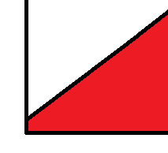
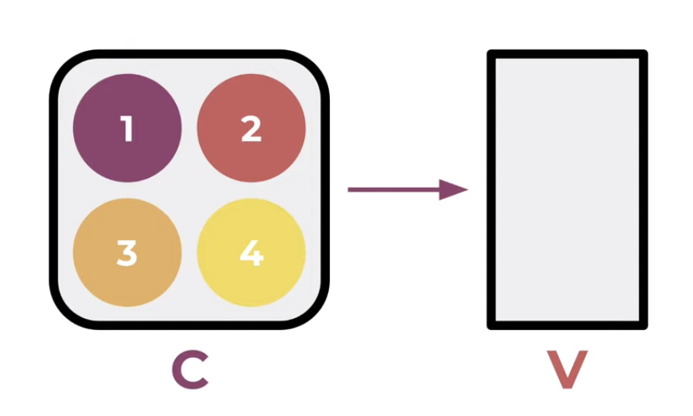
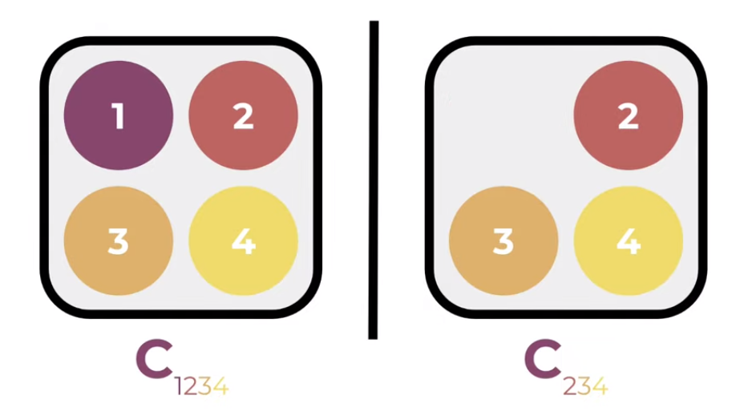
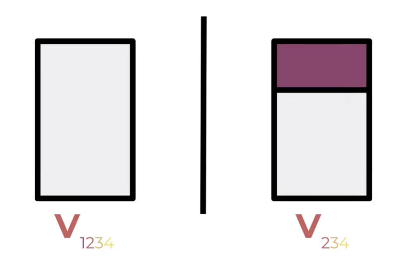
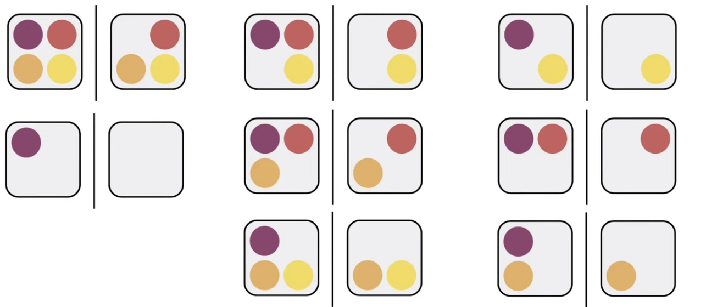
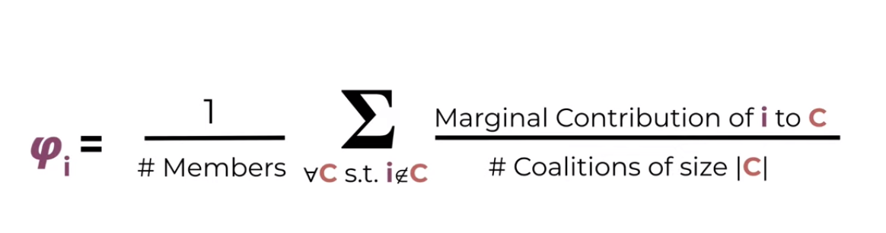
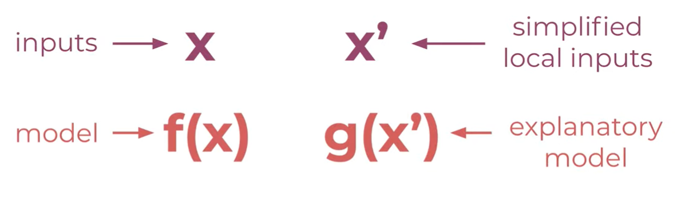
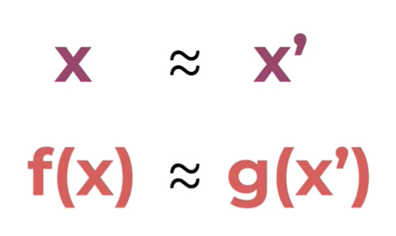
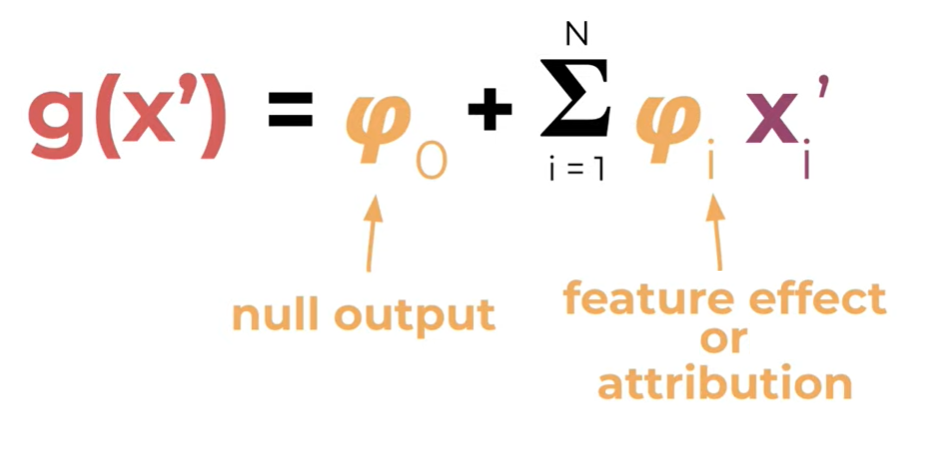
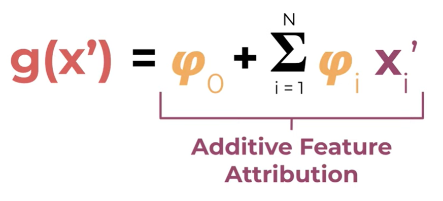

# FLC_Model_Explainers

## What is a model explainer? 

What is a model explainer?
A model explainer is a function designed to show how the model produces different predictions.
Models in 2D are relatively easy to describe. For example, there we could have a classification model determined by a single line.

However, models frequently have more than 2 features, and so cannot be easily placed on a single chart. However, a model explainer can help us answer the following questions.
Which features are the most important?
How does changing those features impact the prediction?
Is the model more complicated than it needs to be?

## How does a model explainer work? -- Richard

Sometimes in machine learning, you'll hear the term 'black box' used to describe the obscurity of machine learning models. Often times when working on a model, it falls to the user to determine how a model came to the conclusions that it did. With model explainers, that is no longer a problem! And so, to prevent model explainers themselves becoming a 'black box' of obscurity, it's time to learn about how they work.
I'll be mostly discussing how the SHAP model works, as it was the first model explainer to hit the scene and is currently among the most popular. Rest assured, other model explainers are either built on top of SHAP or simply work similarly to how SHAP functions.
SHAP's documentation website self-describes as the following: "SHAP (SHapley Additive exPlanations) is a game theoretic approach to explain the output of any machine learning model. It connects optimal credit allocation with local explanations using the classic Shapley values from game theory and their related extensions."
This description, while accurate, is full of technical jargon that is hard to parse. To understand it, we need to understand Shapley values.
Shapley values, named after and introduced by Lloyd Shapley in 1951, are 'game theory' principles used to explain certain mathematical problems. For example, if we have a coalition 'C' that collaborates to produce a value V, how much did each individual member contribute to the final value?

The answer to this may appear simple, but it can become quite tricky when there are interacting effects between members, and when certain permutations can cause members to contribute more than the sum of their parts. So, we calculate the Shapley value of each individual member to determine a sort of relevant worth to the coalition. First, we can take sample a coalition that contains member 1, then looking at the coaltion formed by removing that member. 

We can then compare the respective values of the two resulting coalitions, and compare between the two. The difference is the marginal contribution of member 1 to C(234). That's how member 1 contributed to _that specific group_.

Then, we're able to do this for every single permutation that contains member 1.

Taking the mean of the marginal contribution of member 1 to all of these grants as our Shapley value, signified with the lowercase phi, or $\varphi$.

Mathematically, this is exaplained thusly:

Translating this concept to model explainability is pretty straightforward, as you can imagine. It was first done in 2017 by Scott M Lundburg and Su-In Lee in thier paper, "_A Unified Approach to Interpreting Model Predictions_". You can access their paper [here](https://proceedings.neurips.cc/paper/2017/hash/8a20a8621978632d76c43dfd28b67767-Abstract.html).

This paper is where SHAP was introduced. SHAP changed how we view Shapley values from members of a coalition contributing to a vlue, to features contributing to a function or a model's output.
We can get a clue of how they do so by taking a look at the acronym 'SHAP': Shapley Additive Explanations.
We now know what Shapley values are, and we know what an explanation is (hopefully), but what does additive mean here?
Lundburg and Lee define an addative feature attribution as follows.

Given features inputs x and model f(x), we can define a set of simplified local inputs as x'. This means that we take a feature vector into a discrete binary vector where features are either included or excluded. We can also define an explanatory model g(x'), which we will see it's importance in a moment.

Lundburg and Lee then define two things that we need to ensure. One, if x is roughly equivalent to x', then f(x) is roughly equivalent to g(x').

And two, that g must take this form. Phi-0 here is the null output of the model, which is just the average output of the model, and phi-i is the explained effect of feature i. This is also known as it's attribution.

These two properties together bring us an explanatory model that has additive feature attribution.

The very nice thing about this is thatg it is very easy to see the importance of each feature. All we have to do is look at our phi values and we can determine the contribution of each feature in the model.

## Various Model Explainers 

https://www.analyticsvidhya.com/blog/2020/03/6-python-libraries-interpret-machine-learning-models/
Depending on the project that you are working on, different model explainers will be able to tell you your results in different ways. There are 6 main model explainers, each with their own personality.

### Global Features Importances
Global Features Importances (Model Level): It lets us analyze model weights to understand the global performance of the model.

### Local Features Importances 
Local Features Importances (Individual Example Level): It lets us analyze individual data example's prediction to understand the local performance of the model. This can help us drill down why the particular prediction was made and which data features played what role in that prediction.

# Model Explainer Example Derek LIME

# Model Explainer Example Tanner 

# Model explainer Example Eli 5
https://coderzcolumn.com/tutorials/machine-learning/how-to-use-eli5-to-understand-sklearn-models-their-performance-and-their-predictions
### EXPLAIN LIKE IM 5  (ELI 5)

# Amazing dashboarding for model explainers

https://titanicexplainer.herokuapp.com/classifier/

resources: 
https://www.kaggle.com/code/dansbecker/advanced-uses-of-shap-values/tutorial

https://medium.com/analytics-vidhya/explain-ml-models-shap-library-5ce375c85d7d

https://www.kaggle.com/code/scratchpad/notebook616777f210/edit

https://spark.apache.org/docs/latest/api/python/reference/api/pyspark.mllib.tree.GradientBoostedTrees.html

https://interpret.ml/docs/lime.html

https://github.com/TeamHG-Memex/eli5

